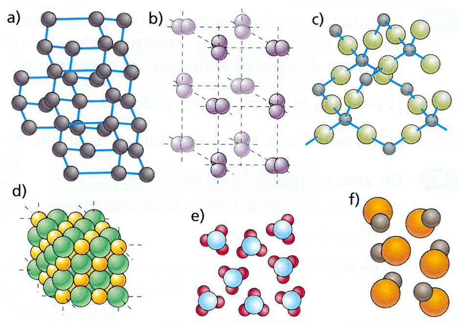

---
encabezado:
    titulo: "La materia: enlace químico"
    nivel:  "CCGG 2º Bach"
    tema:   "Ficha 3"
fuentes:
-   OXF 4E 2016
...

1.  Dadas las siguientes especies químicas: K^+^, Cl^-^, H, Fe, O2, H2O, CaCl2. Selecciona, entre ellas: 
    a)  Dos átomos. 
    b)  Dos iones. 
    b)  Dos elementos. 
    a)  Dos moléculas. 
    a)  Dos compuestos. 
    a)  Un metal y un no metal. 

# Enlace iónico

1.  Imagina que tienes dos frascos, con sendas sustancias sólidas cristalinas muy 
    semejantes, que han perdido su etiqueta. Sabes que una es un compuesto 
    iónico y otra un compuesto covalente reticular. ¿Qué prueba realizarías para 
    averiguar qué sustancia contiene cada frasco, si solo dispones de agua?

1.  Observa las propiedades del bromuro de potasio, KBr:

    Propiedad                            KBr
    ---------------------------------- ----------------
    Aspecto                              Cristalino
    $T_f (#ºC)$                          730
    $T_e (#ºC)$                          1435
    Conductividad eléctrica (líquido)    Alta
    Conductividad eléctrica (sólido)     Muy baja
    Solubilidad en agua                  Muy alta

    a)  A la vista de estas propiedades, justifica el tipo de 
        enlace existente en el bromuro de potasio. 
    b)  ¿Es correcto hablar de moléculas de bromuro de potasio? 

# Enlace covalente

1.  Muchos elementos químicos gaseosos se presentan, a temperatura normal, 
    en forma de moléculas diatómicas; por ejemplo, el oxígeno, O2, el nitrógeno, N2, el flúor, F2 ... Observa las configuraciones electrónicas de los átomos 
    de estos elementos y cómo se forman sus respectivas moléculas. 
    a)  ¿Cuántos electrones comparten los dos átomos de flúor, los dos de oxígeno y los dos de nitrógeno? 
    b)  ¿Por cuántos electrones puede considerarse que está rodeado cada uno 
        de estos átomos? 
    c)  ¿A qué gas noble se asemejan de esta forma? 

2.  Relaciona en tu cuaderno las siguientes propiedades con el tipo de com- 
    puesto covalente: molecular o reticular. Una misma propiedad puede corres- 
    ponder a dos tipos de compuestos. 
    a)  Gases, líquidos o sólidos frágiles o blandos. 
    b)  Sólidos muy duros. 
    c)  No conducen la electricidad.
    d)  Elevados puntos de fusión y ebullición. 
    e)  No son solubles en agua, pero sí en disolventes como el tolueno o la acetona. 
    f)  Son insolubles en cualquier tipo de disolvente. 
    g)  Bajos puntos de fusión y de ebullición. 

7.  ¿Por qué los compuestos covalentes reticulares tienen una dureza tan alta? 
    
1.  ¿Por qué el yodo y el carbono (diamante) no conducen la corriente eléctrica 
    y el carbono (grafito) sí?

2.  Clasifica estas sustancias de acuerdo con el tipo de enlace que presentan: H2O, CH4, HBr, KBr, NaI, MgS.

1.  Indica si el enlace entre los átomos de las moléculas 
    siguientes es simple, doble o triple: H2, O2, F2, N2, Cl2.

1.  En las moléculas diatómicas, como el H2 y en los cristales atómicos,
    como el diamante, los átomos están unidos por enlaces covalentes. Sin embargo, 
    el hidrógeno es un gas y el diamante, un sólido. Trata de explicar este hecho. 

1.  El cloro y el oxígeno pueden formar distintos compuestos
    (OCl2, O3Cl2, O5Cl2, O7Cl2); sin embargo, ambos elementos
    tienen tendencia a captar electrones. ¿Cómo crees que se mantienen unidos? 

1.  ¿Qué diferencias encuentras entre un cristal iónico y un cristal covalente reticular?

2.  La siguiente tabla proporciona información acerca de las propiedades de ciertas sustancias:
 
    \begin{tblr}{
    %    width=1.2\linewidth,
        colspec = {ccccc},
        stretch = 1,
    %    rowsep = 0pt,
        hline{1,3,7} = {solid},
        cell{1}{1-2,5} = {r=2},
        cell{1}{3} = {c=2}{c},
    }
        Sustancia & $T_f\ (\unit{\celsius})$ & Conductividad eléctrica & & Soluble en agua \\
                  &             &   Sólido   &   Líquido  &                 \\
            A     &     112     &     No     &     No     &        No       \\
            B     &     680     &     No     &     Sí     &        Sí       \\
            C     &     1610    &     No     &     No     &        No       \\
            D     &     660     &     No     &     Sí     &        Sí       
    \end{tblr}

    a)  ¿Cuáles son compuestos iónicos? 
    a)  ¿Cuál es un compuesto covalente molecular? 
    a)  ¿Cuál de ellas tiene un alto punto de fusión comparado con el resto? ¿Por qué no puede ser un compuesto iónico?

3.  En un laboratorio químico se han obtenido tres nuevas Sustancias (pueden ser compuestos o elementos en 
    variedades no habituales). Los científicos que las han aislado nos dan la siguiente información sobre ellas:

    +--------------------------+------------------------+------------------------+------------------------+
    | Sustancia A              | Sustancia B            | Sustancia C            | Sustancia D            |
    +==========================+========================+========================+========================+
    | Sólida,                  | Sólida,                | Sólida,                | Sólida,                |
    | formada por la unión     | formada por la unión   | formada por la unión   | formada por la unión   |
    | de átomos de un          | de dos elementos       | de dos elementos       | de dos elementos       |
    | mismo elemento.          | diferentes.            | diferentes.            | diferentes             |
    +--------------------------+------------------------+------------------------+------------------------+
    | Bajos puntos de          | Elevados puntos de     | Bajos puntos de        | Elevados puntos de     |
    | fusión y ebullición.     | fusión y ebullición.   | fusión y ebullición.   | fusión y ebullición    |
    +--------------------------+------------------------+------------------------+------------------------+
    | Se disuelve en           | No es soluble en agua. | No es soluble en agua. | Es soluble en agua.    |
    | tetracloruro de carbono. |                        |                        |                        |
    +--------------------------+------------------------+------------------------+------------------------+
    | No conduce la            | No conduce la          | No conduce la          | No conduce la          |
    | corriente eléctrica      | corriente eléctrica.   | corriente eléctrica.   | corriente eléctrica.   |
    +--------------------------+------------------------+------------------------+------------------------+

    ¿Qué hipótesis realizarías acerca de qué tipo de enlace es el que mantiene unidos a los átomos en estas sustancias? 

1.  En la situación de la actividad anterior, los científicos del laboratorio te permiten realizar solo una prueba 
    más para ampliar la información acerca de estas sustancias. Las pruebas pueden ser las siguientes:

    a)  Conductividad de la corriente eléctrica en estado disuelto o fundido 
    b)  Dureza 
    c)  Solubilidad en tetracloruro de carbono 
    d)  Fragilidad

    ¿Qué pruebas solicitarías para confirmar las hipótesis planteadas en la actividad anterior? (Puedes solicitar la misma prueba para más de una sustancia). 

2.  Siguiendo con el caso anterior, los científicos te piden que asignes una estructura a cada una de las sustancias.
    ¿Cuál de las siguientes asignarías a cada una de las sustancias?
    
    
