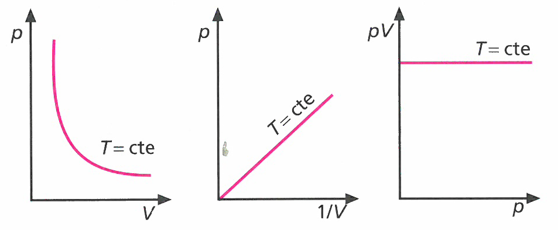

---
encabezado:
    titulo: "La materia: ecuaciones de los gases"
    nivel:  "CCGG 2º Bach"
    tema:   "Ficha 4"
fuentes:
-   OXF 4E 2016
---

# Gases

1.  ¿Por qué la gráfica V-T, a presión constante, es una recta?

1.  ¿Qué se entiende por gas ideal?

1.  El manómetro que se utiliza para calcular la presión de los neumáticos de un vehículo, ¿mide la presión absoluta en el interior del neumático?

1.  ¿Cuál de estas gráficas representa la ley de Boyle?
    

1.  Indica de forma razonada si las siguientes afirmaciones son verdaderas o falsas:
    a)  Si se calienta un gas desde 10#ºC hasta 20#ºC, a presión constante, el volumen se duplica.
    b)  El volumen se reduce a la mitad si se enfría un gas desde 273#ºC hasta 0#ºC, a presión constante.
    c)  Si se enfría un gas desde 600#ºC hasta 200#ºC, a presión constante, el volumen se reduce a la tercera parte.

1.  Las dimensiones de una habitación son $10 \times 5 \times 3#m$. Si al encender la calefacción, la temperatura pasa de 10#ºC a 25#ºC, ¿qué volumen de aire, medido a 25#ºC, entrará o saldrá de la habitación por los resquicios de puertas y ventanas?

    {S} 8#m3

1.  Calcula cuántos recipientes de 2#L a 20#ºC y 1#atm se pueden llenar con los 50#L de oxígeno que contiene una bombona de este gas a 6#atm y 20#ºC.

    {S} 150 recipientes

1.  Un gas ocupa un volumen de 2#L en condiciones normales de presión y temperatura. ¿Qué volumen ocupará la misma masa de gas a 2#atm de presión y 50#ºC de temperatura?

    {S} 1,18#L

1.  En un recipiente de 4#L hay un gas a una presión de 6#atm. Calcula el volumen que ocuparía si duplicásemos la presión a temperatura constante.

    {S} 2#L

1.  Un gas ocupa un volumen de 80#cm3 a 10#ºC y 715#mmHg. ¿Qué volumen ocupará este gas en condiciones normales?

    {S} 72,6#cm3

1.  Tenemos 400#cm3 de oxígeno en condiciones normales. ¿Qué presión ejercerá un volumen de 500#cm3 si la temperatura aumenta en 25#ºC?

    {S} 0,87#atm

1.  ¿Qué volumen ocupan, en condiciones normales, 14#g de dinitrógeno?

    {S} 11,2#L

1.  Se tienen 4#L de un gas en condiciones normales:
    a)  ¿Qué volumen ocupará a 30#ºC y 2#atm de presión?
    b)  ¿Cuántos moles de gas hay en la muestra?

    {S} a) 2,22#L; b) 0.17#mol

1.  Un recipiente cerrado de 0,75#L contiene CO2 a la presión de 6#atm y 27#ºC de temperatura. Calcula:
    a) La masa de CO2 que contiene.
    b) La presión cuando la temperatura es de -173#ºC.

    {S}  a) 7,92#g; b) 2#atm

1.  Un gas ocupa un volumen dentro de un recipiente extensible de 2#L cuando está sometido a una presión de 4#atm. Si la presión disminuye a 1/3 de su valor, ¿cuál será el volumen que ocupará dicho gas?

    {S} Aplicando la ecuación a $T = cte$ de Boyle y Mariotte, tendremos:
    $p_1 V_1 = p_2 V_2$; $4#atm \cdot 2#L = 4/3#atm \cdot V_2$, de donde $V_2 = 6#L$

1.  Un gas en un recipiente extensible ocupa un volumen de 3#L cuando está sometido a una presión constante de 4#atm y a una temperatura de 200#ºC.
    Si esta disminuye a 100#ºC, ¿qué volumen ocupará dicho gas?

    {S}
    Aplicando la ecuación a $p$ constante que acabamos de estudiar, tendremos:
    $$\frac{p_1}{T_1} = \frac{p_2}{T_2} \Longrightarrow \frac{1,5#atm}{473#K} = \frac{p_2}{373#K} \Longrightarrow p_2 = 1.2#atm$$

1.  Un gas ocupa, dentro de un matraz de vidrio, un volumen de 2#L cuando la presión es 1,5#atm y la temperatura 200#ºC.
    Si esta disminuye a 100#ºC, ¿cuál será la presión que ejercerá dicho gas?

    {S} Aplicando la ecuación a $V$ constante, tendremos:
    $$\frac{V_1}{T_1} = \frac{V_2}{T_2} \Longrightarrow \frac{3#L}{473#K} = \frac{V_2}{373#K} \Longrightarrow V_2 = 2.4#L$$
    Un error frecuente es no pasar los grados centígrados a Kelvin. Si se resuelve el ejercicio con los valores 100#ºC y 200#ºC, el resultado es 0,75#atm, muy diferente del valor real.

1.  En el interior de una jeringuilla tienes 15,0#cm3 de aire a presión atmosférica (1#atm) y a temperatura ambiente (22#ºC).
    Calcula el volumen que ocupará dicha masa de aire en el interior de la jeringuilla cuando la presión sea de 700#mmHg y la temperatura de 5#ºC.
    ¿Cuántos moles de aire tenías en la jeringuilla en las condiciones iniciales? ¿Variará el número de moles al cambiar las condiciones?

    {S} Aplicando la ecuación de estado de los gases, tenemos:
    $$\begin{array}{llll}
        \text{Estado 1:}    & p_1 = 760#mmHg\ (1,0#atm)   & T_1 = 295#K & V_1 = 15,0#cm3 \\
        \text{Estado 2:}    & p_2 = 700#mmHg              & T_2 = 278#K & V_2 = ?
    \end{array}$$
    $$\frac{760#mmHg \cdot 15,0#cm3}{295#K} = \frac{700#mmHg \cdot V_2}{278#K} \qquad \text{ de donde } V_2 = 15,3#cm3$$
    Para calcular el número de moles de aire iniciales que teníamos aplicamos la ecuación de Clapeyron:
    $$pV = nRT \qquad \text{ de donde } n = \frac{pV}{RT} = \frac{1#atm \cdot 0.0150#L}{0.082#atm·L/mol/K \cdot 295#K} = 6.2e-4#mol$$
    Evidentemente, el número de moles no varía, pues la masa no depende de la presión, la temperatura o el volumen, ya que el número de moléculas de aire no cambia.
    Para comprobarlo aplicaríamos de nuevo la ecuación anterior:
    $$n = \frac{pV}{RT} = \frac{700 / 760#mmHg \cdot 0.0153#L}{0.082#atm·L/mol/K \cdot 278#K} = 6.2e-4#mol$$

1.  Diez litros de un gas medidos en condiciones normales, ¿qué volumen ocuparán si cambiamos las condiciones a 50#ºC y 4#atm de presión?

    {S} 2,96#L

1.  En un matraz de 5#L hay 42#g de N2 a 27#ºC. Se abre el recipiente hasta que su presión se iguala con la presión atmosférica, que es de 1#atm.
    a) ¿Cuántos gramos de N2 han salido a la atmósfera?
    b) ¿A qué T deberíamos poner el recipiente para igualar la presión inicial?

    {S}
    a) 36,3#g de N2 han salido;
    b) $T' = 2214#K$.

1.  En condiciones normales de presión y temperatura, 1#mol de NH3 ocupa 22,4#L y contiene 6,02e23# moléculas. Calcula:
    a) ¿Cuántas moléculas habrá en 37#g de amoniaco a 142#ºC y 748#mmHg?
    b) ¿Cuál es la densidad del amoniaco a 142#ºC y 748#mmHg?

    {S}
    a) 1,31e24# moléculas de NH3
    b) $\rho = 0,49#g/L$.

2.  Resuelve los siguientes ejercicios referidos a la ecuación de Clapeyron:
    a)  Un gas ocupa un volumen de 15#L a 60#ºC y 900#mmHg. Qué volumen ocuparía en condiciones normales?
    b)  En una bombona de 15,0#L hay gas helio a 20#ºC. Si el manómetro marca 5,2#atm, ¿cuántos gramos de helio hay en la bombona?
        ¿A qué temperatura estaría el gas si la presión fuera la atmosférica?
    c)  Una cierta cantidad de aire ocupa un volumen de 10#L a 47#ºC y 900#mmHg. Si la densidad del aire es de 1,293#g/L, ¿qué masa de aire hay en el recipiente?

    {S}
    a) $V = 14,6#L$;
    b) $m = 13#g$ de He, $T = 56#K$;
    c) $m = 13#g$ de aire.
