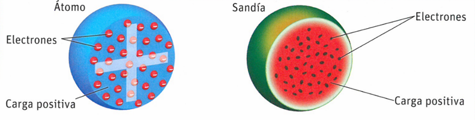
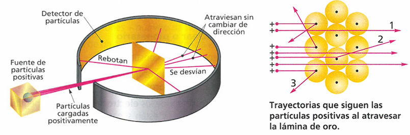
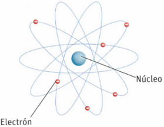
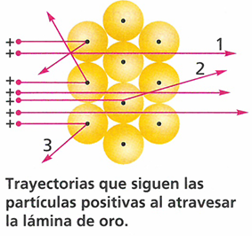
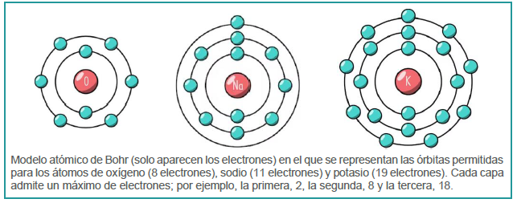
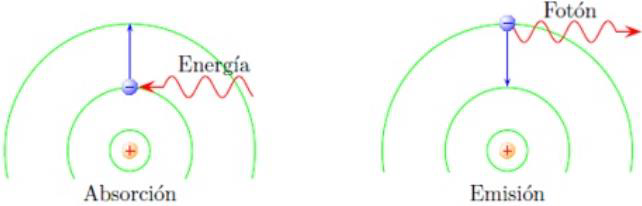
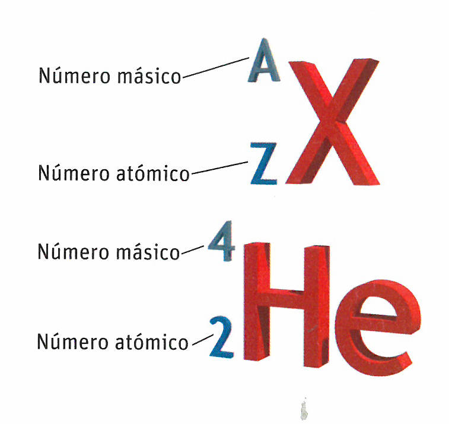
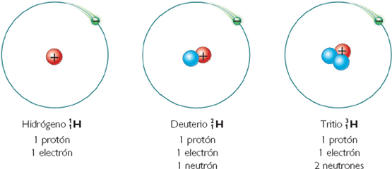
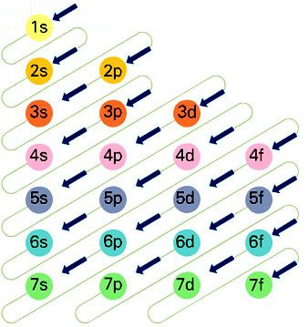

# El átomo

La materia está formada por partículas diminutas llamadas **átomos**, constituidos a su
vez por partículas más pequeñas aún. Pero no siempre estuvo clara la manera en que
se organizaban esas partículas para formar los átomos. A lo largo de la historia, el
átomo pasó por diferentes modelos hasta llegar al actual.

## Teoría atómica de Dalton

A finales del siglo XVIII y comienzos del XIX, científicos como Lavoisier, Proust y Dalton investigaron la conservación de la masa y la relación entre las masas de las sustancias que intervienen en una reacción química. Para poder explicar los resultados
obtenidos por estos científicos, Dalton propuso que la materia estaba formada por partículas diminutas
llamadas átomos, que eran **indivisibles** (no estarían formados por partículas más
pequeñas) e **inmutables** (no se podían transformar unos en otros). Cada compuesto
químico estaría formado por la unión de determinados átomos en determinadas
proporciones.

De esta manera, Dalton establecía que la materia no era continua (estaba formada por
pequeños corpúsculos), explicaba las reacciones químicas como la reordenación de los
átomos y establecía la diferencia entre elemento y compuesto químico.

El modelo de Dalton no contemplaba que el átomo pudiera dividirse, pero el
descubrimiento de partículas más pequeñas que el átomo, como el electrón, demostraron que no estaba en lo cierto. En 1904, J. J. Thomson propone un modelo atómico en el que el átomo es una especie de esfera de carga positiva continua y esponjosa que contiene casi toda la masa. Los electrones están incrustados en ella de forma similar a como lo están las pasas en un bizcocho; por eso, se llamó el "pudin de pasas". Actualmente, sería más fácil hacer un símil con una magdalena rellena de chips de chocolate o con las pepitas dentro de una sandía.

## Partículas subatómicas

Los fenómenos eléctricos eran conocidos desde la antigua Grecia, pero no fueron objeto de una investigación sistemática hasta el s. XIX. Con el objetivo de determinar la naturaleza de la electricidad y las cargas eléctricas, a finales del siglo XIX y comienzos del XX, varios científicos realizaron diferentes experimentos con tubos de vidrio que contenían un gas a baja presión al que se sometía a descargas eléctricas de alto voltaje.

Estas experiencias permitieron a J. J. Thomson identificar la partícula responsable de la carga eléctrica negativa, el electrón; y a E. Goldstein, la partícula responsable de la carga eléctrica positiva, el protón. Con estos experimentos, ambos científicos pudieron calcular el valor de la carga eléctrica y la masa de ambas partículas.

Sin embargo, algo no encajaba: la suma de la masa de los protones más la de los electrones era más pequeña que la masa del átomo en su conjunto. Esto hizo a los científicos plantearse que podía existir algo más: una partícula con masa, pero sin carga eléctrica.
En 1932, J. Chadwick bombardeó una lámina de berilio con partículas positivas y observó que emitía una radiación de gran energía. Posteriormente, demostró que esa radiación estaba formada por unas partículas eléctricamente neutras, que denominó neutrones, cuya masa era un poco mayor que la del protón. Con ello, todas las partículas subatómicas estaban al descubierto.

Partícula           Carga             Masa                             Descubrimiento
--------------  ----------------   -----------------------      ---------------------
Electrón         -1,602e-19#C       9,109e-31#kg (0#uma)          J. J. Thomson, 1897
Protón           1,602e-19#C        1,6726e-27#kg (1#uma)          E. Goldstein, 1886
Neutrón          0#C                1,6749e-27#kg (1#uma)           J. Chadwick, 1932

## Modelo de Rutherford

En 1909, E. Rutherford realizó un experimento revolucionario. Bombardeó una lámina de oro muy fina con partículas radioactivas cargadas positivamente que se desplazaban a gran velocidad, y midió las trayectorias de estas partículas después de atravesar la lámina.

Los resultados del experimento sorprendieron a Rutherford. Según el modelo atómico de Thomson, las partículas positivas deberían haber atravesado la lámina sin desviarse; ya que los átomos eran perfectamente neutros, no podían interactuar con las partículas positivas. Sin embargo, algunas partículas se desviaban considerablemente, mientras que otras incluso rebotaban hacia la fuente.

Para explicar estos resultados, Rutherford propuso en 1911 un nuevo modelo atómico, radicalmente distinto a los anteriores. El átomo tendría 2 zonas bien diferenciadas:

- Una zona central muy pequeña, densa y cargada positivamente, que contiene los protones, a la que llamó **núcleo**.
- Una zona periférica casi vacía en la que los electrones, cargados negativamente, giran alrededor del núcleo y a cierta distancia del él, a la que llamó **corteza**. Por lo tanto, el resto del átomo sería **espacio vacío**.

Dada la similitud entre este modelo y la forma en que los planetas giran alrededor del Sol (de la que Rutherford había extraído la inspiración para su modelo), a este modelo también se lo conoce como *modelo planetario*.

De este modo, Rutherford explicaba los resultados de su experimento diciendo que las partículas que se desviaban ligeramente lo hacían porque pasaban cerca del núcleo positivo y se veían repelidas por él, mientras que las que no se desviaban pasaban alejadas del núcleo y no eran afectadas por la repulsión. Aquellas partículas que *rebotaban* serían aquellas que se encontraban frontalmente contra el núcleo, sufriendo una mayor repulsión.

## Modelo de Bohr y modelo mecanocuántico

Según el modelo del *átomo planetario*, los electrones giran a gran velocidad en torno al núcleo, sin que sepamos a qué distancia de él se encuentran. Sin embargo, es un hecho conocido que cualquier carga eléctrica que gire debe emitir energía en forma de radiación. Si esto sucediera, el electrón iría perdiendo energía y se acercaría cada vez más al núcleo describiendo una trayectoria espiral, y acabaría cayendo sobre él.

Para reparar este *fallo* del modelo de Rutherford, Niels Bohr propuso un modelo modificado con las siguientes características nuevas:

- Los electrones solo pueden girar alrededor del núcleo en ciertas órbitas determinadas, de radios concretos, denominadas órbitas permitidas. En cada órbita el electrón tiene un nivel de energía, mayor cuanto más lejos esté del núcleo, y permanece estable en ella sin emitir ni absorber energía.

- Los electrones absorben o emiten energía al cambiar de órbita. Para que un electrón pase de una órbita a otra más lejana del núcleo deberá absorber energía, ya que pasa a un nivel energético mayor. Por el contrario, al pasar a una órbita más cercana al núcleo (y, por tanto, con un nivel de energía menor) desprenderá energía en la forma de un fotón de luz.

## Caracterización del átomo

Como ya sabemos, los átomos están formados por tres tipos básicos
de partículas subatómicas: protones y neutrones en el núcleo, y electrones en la corteza alrededor del núcleo. Cada elemento químico se caracteriza por tener una diferente composición de partículas subatómicas, lo que hace que su comportamiento químico y sus propiedades sean diferentes a las de otros elementos.

Los elementos químicos se pueden identificar por el número de protones en su núcleo. Por ello, podemos definir un elemento como una clase de átomos que tienen el mismo número de protones. Todos los átomos de oxígeno tienen 8 protones, y los de hierro 26 protones. A este valor lo llamaremos su *número atómico*.

> **Número atómico (Z)**
> :   es el número de protones en el núcleo del átomo. Permite identificar los átomos de un mismo elemento químico.

En condiciones normales, un átomo tiene carga eléctrica neutra, por lo que tendrá el mismo número de electrones que de protones. Por ello, el número atómico nos permite conocer también el número de electrones en la corteza. Esto último no será correcto si tenemos un átomo cargado eléctricamente (un *ion*). Las propiedades químicas de un átomo dependerán de su número de electrones.

Como la masa de los electrones es despreciable respecto a la de protones y neutrones, la masa de un átomo se puede calcular a partir de la suma de las masas de todos los protones y neutrones del átomo. Dado que trabajar en las unidades del Sistema Internacional a esta escala tan pequeña produce unos números incómodos de manejar, se define una nueva unidad de masa, la *unidad de masa atómica* o **uma** (con símbolo u), y se asigna al protón y al neutrón el valor de 1#uma. Dicho de otro modo, $1#uma = 1,66e-27#kg$. La masa atómica será el valor, en uma, de la masa de los protones y neutrones del núcleo del átomo. Por comodidad, este valor se calcula a partir del *número másico*.

> **Número másico (A)**
> :   es la suma del número de protones y neutrones en el núcleo del átomo.

También podemos definir el *número neutrónico (N)* como el número total de neutrones que se encuentran en el núcleo. Sin embargo, este número es fácil de calcular a partir de la siguiente relación:

$$\text{A} = \text{Z} + \text{N}$$

Por lo tanto, conociendo **Z** y **A** es posible conocer el número de partículas subatómicas presentes en un átomo. Para representar toda esta información de forma abreviada se acompaña al símbolo del elemento de los valores A (arriba a la izquierda) y Z (abajo a la izquierda).

**Ejemplos**

Representación       Z     A    p^+^    e^-^    n^0^
----------------   ----  ----  ------  ------  ------
\ch{^{12}6C}        12    6      6       6       6
\ch{^{23}11Na}      23    11     11      11      12

Como vemos, el número de protones coincide con el de electrones, pero no tiene por qué ser el mismo que el de neutrones.

El número atómico (de protones) de un elemento químico es invariable, pero el de
neutrones puede variar. Dos átomos depueden tener el mismo número de protones (son,
por tanto, el mismo elemento químico) pero diferente número de neutrones.

**Isótopo**
:   se denomina isótopo a los átomos de un mismo elemento que presentan el mismo número atómico (Z) pero diferente número másico (A) y, por lo tanto, diferente masa atómica.

Los isótopos son átomos distintos del mismo elemento químico. Todos los isótopos de un elemento presentarán las mismas propiedades químicas, pues estas dependen del número de electrones. Sin embargo, pueden tener distintas propiedades físicas, como la masa.
Se conocen isótopos de casi todos los elementos químicos, pero los hay en distinta proporción según el isótopo y el elemento químico. Por ejemplo, se conocen tres isótopos del hidrógeno: protio, deuterio y tritio, siendo el protio el más abundante (99,98% de abundancia). El carbono-14 \ch{^{14}C} es un isótopo del carbono con 8 neutrones.

En ocasiones, un átomo puede perder o ganar algún electrón, por lo que se convierte en un **ion** y pasa a tener carga eléctrica. Los iones se representan añadiendo la carga neta que tienen al símbolo del átomo, y se nombran según la carga predominante del átomo:

> **Catión**
> : átomo que ha perdido electrones, adquiriendo carga positiva y convirtiéndose en un ion positivo. Ejemplos: \ch{H+} \ch{Na+} \ch{Ca^2+} \ch{Fe^3+}

> **Aniones**
> : átomo que ha ganado electrones, adquiriendo carga negativa y convirtiéndose en un ion negativo. Ejemplos: \ch{Cl-} \ch{O2-}

### Configuración electrónica

Las propiedades químicas de los diferentes elementos dependen de cómo se distribuyen sus electrones en la corteza. Esta distribución no es al azar, sino que sigue unas pautas determinadas:
- Los electrones se distribuyen, alrededor del núcleo, en niveles de energía creciente.
- Hay 7 niveles de energía, numerados desde el núcleo del 1 al 7. El nivel 1 será el más cercano al núcleo y el menos energético; el 7 será el más externo y el más energético.
- En cada nivel puede haber subniveles (s, p, d, f) y en cada subnivel hay un número fijo de orbitales: 1, 3, 5 y 7 respectivamente.
- Como cada orbital puede alojar hasta 2 electrones, los subniveles podrán alojar 2, 6, 10 y 14 electrones.

La **configuración electrónica** de un átomo es la distribución de sus electrones en los diferentes niveles y subniveles de energía. Para representarla, se parte del número de electrones del átomo y se van colocando en los sucesivos subniveles por orden de energía creciente. En realidad, los subniveles de un nivel no siempre tienen más energía que los del nivel anterior; por ejemplo, el subnivel 4s, a pesar de pertenecer al nivel 4, tiene menos energía que el 3d, que pertenece al nivel 3.

Debido a esta complejidad se utiliza el diagrama de Moeller, en el que se sigue el orden de sus flechas para ir llenando los subniveles por los que pasa cada flecha, en el orden que determina cada una.

Los electrones alojados en el último nivel se denominan **electrones de valencia** e intervienen en la mayoría de los procesos químicos.

#### **Ejemplo 1**: Representa la configuración electrónica del cloro (Cl)

Partimos del número atómico (deben darnos el dato o lo consultamos en la tabla periódica): $Z = 17$. Tenemos 17 protones y 17 electrones.

Ahora, colocamos todos los electrones en los subniveles correspondientes, siguiendo las flechas del diagrama de Moeller, hasta que sumen 17. Para escribirlo, indicamos el nivel, el subnivel y como superídice, el número de electrones del que contiene el subnivel: 1s^2^ 2s^2^ 2p^6^ 3s^2^ 3p^5^. En el último subnivel 3p cabrían hasta 6 electrones, pero con los 17 del cloro solo quedan 5 cuando llegamos a él (3p^5^).

El átomo de cloro tiene sus electrones distribuidos en 3 niveles y en el nivel más externo (el 3) hay 7 electrones, sus electrones de valencia, que le dan la mayoría de sus propiedades químicas, como su capacidad de unión con otros átomos para formar moléculas.

Para acortar la longitud de la configuración electrónica, especialmente cuando se obtienen configuraciones con nivel 3 o superior, es habitual indicar el gas noble que tiene una configuración electrónica similar y añadirle la configuración electrónica del último nivel de energía. Por ejemplo, en el caso del cloro, su configuración electrónica incluye la del gas noble Ne (1s^2^ 2s^2^ 2p^6^) por lo que podríamos escribir la configuración electrónica del cloro como [Ne] 3s^2^ 3p^5^.

#### Ejemplo 2: Configuración electrónica del Br ($Z = 35)$.

1s^2^ 2s^2^ 2p^6^ 3s^2^ 3p^6^ 4s^2^ 3d^10^ 4p^5^

El bromo tiene 4 niveles ocupados y en el más externo (el 4) hay 7 electrones, los electrones de valencia. En este caso, los electrones del nivel 3d no se cuentan para los electrones de la capa de valencia, aunque el orbital 3d se *llena* después del 4s.

#### Ejemplo 3: Escribe la configuración electrónica del \ch{K+} ($Z = 19$)

Partiendo del número atómico ($Z = 19$), sabemos que el átomo tiene 19 protones. El átomo que tenemos tiene una carga positiva (1+), lo que significa que su número de electrones es inferior en 1 unidad al número de protones; de modo que el número de electrones será 18. Sabiendo esto, realizamos la configuración electrónica del mismo modo que las anteriores.

1s^2^ 2s^2^ 2p^6^ 3s^2^ 3p^6^

#### Otros ejemplos

- Nitrógeno N ($Z = 7$): 1s^2^ 2s^2^ 2p^3^ o [He] 2s^2^ 2p^3^
- Magnesio Mg ($Z = 12$): 1s^2^ 2s^2^ 2p^6^ 3s^2^ o [Ne] 3s^2^
- Fósforo P ($Z = 15$): 1s^2^ 2s^2^ 2p^6^ 3s^2^ 3p^3^ o [Ne] 3s^2^ 3p^3^
- Anión azufre \ch{S^2+} ($Z = 16$): 1s^2^ 2s^2^ 2p^6^ 3s^2^ 3p^6^