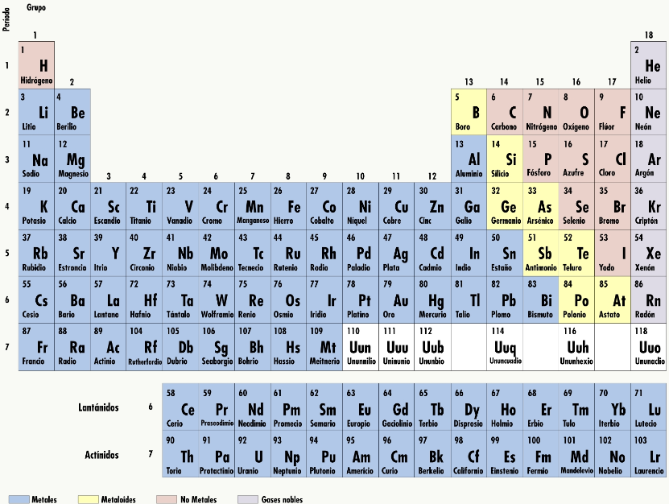
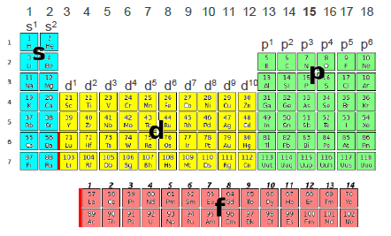

# La tabla periódica

Durante el siglo XIX aumentó extraordinariamente el número de elementos químicos conocidos. Por ello, se buscó alguna forma de ordenar y clasificar los elementos, agrupándolos en familias según sus propiedades químicas.

En la tabla periódica, los elementos están ordenados por orden creciente de números atómicos, de forma que este número va aumentando en una unidad al pasar de izquierda a derecha y de arriba abajo, de un elemento al siguiente.

Los elementos se distribuyen en 7 filas, llamadas **periodos** y 18 columnas, llamadas **grupos**. Los periodos corresponden a los niveles de energía en los que se distribuyen los electrones de cada elemento: los elementos del periodo 7 tienen más capas electrónicas que los del periodo 1. Los elementos del mismo grupo (misma columna) presentan propiedades químicas similares, ya que tienen el mismo número de electrones en la capa de valencia (los de la última capa) y por tanto, tienen una configuración electrónica análoga.

La tabla periódica constituye una herramienta muy útil en química, ya que la posición de cada elemento en ella nos sirve para deducir muchas de sus propiedades químicas. Podemos clasificar a los elementos en 4 tipos, según la tendencia que tienen sus átomos a perder o ganar electrones.

- **Metales:** en la izquierda y centro de la tabla (recuadros azules), tienden a perder electrones y convertirse en cationes. Son por ello buenos conductores de la electricidad y el calor.

- **No metales**: en la parte superior derecha de la tabla (recuadros rojos), tienden a ganar electrones y convertirse en aniones. Son malos conductores de la electricidad y el calor.

- **Semimetales o metaloides**: presentan características intermedias entre los metales y los no metales, encontrándose entre ambos, en diagonal entre el boro y el astato (recuadros amarillos). Son mejores conductores de la electricidad y el calor que los no metales, pero no tanto como los metales.

- **Gases nobles**: localizados en el periodo 18, a la derecha de la tabla (recuadros grises). Todos tienen su última capa electrónica completa, por lo que son muy estables: no reaccionan con otros elementos y no forman iones.

## Propiedades periódicas

Las propiedades periódicas son características de los elementos químicos que se relacionan de forma directa con su ubicación en la tabla periódica, y que varían de forma repetitiva al desplazarnos por la tabla. Es precisamente la repetición de estas propiedades cada cierto número de elementos la que da a la tabla el nombre de *periódica*.

### Configuración electrónica

La configuración electrónica es una propiedad periódica, ya que todos los elementos de un mismo grupo tienen el mismo número de electrones en su última capa (el mismo número de electrones de valencia), por lo que tienen propiedades químicas similares. Por ejemplo, todos los elementos del grupo 15 tienen cinco electrones en su última capa (la capa de valencia, marcada en **negrita** en el siguiente ejemplo) acaban en ns^2^ np^3^.

- N: 1s^2^ **2s^2^ 2p^3^**
- P: 1s^2^ 2s^2^ 2p^6^ **3s^2^ 3p^3^**
- As: 1s^2^ 2s^2^ 2p^6^ 3s^2^ 3p^3^ **4s^2^** 3d^10^ **4p^3^**

Debido a esto, la tabla también se puede dividir en cuatro bloques, en función del tipo de orbital donde entra el último electrón de la capa de valencia: los bloques s, p, d y f.

### Radio atómico

El radio atómico se define como la distancia desde el centro del núcleo de un átomo hasta su última capa de electrones.

**En un periodo**, el radio atómico disminuye hacia la derecha porque, aunque aumenta el número de electrones (en una unidad), al aumentar también el número de protones del núcleo, estos ejercen cada vez mayor atracción sobre aquellos, contrayendo al átomo.

**En un grupo**, el radio atómico aumenta al descender en el mismo, ya que el número de electrones aumenta en mayor medida (una capa completa en vez de una unidad), lo que hace que los electrones más externos se distancien mucho del núcleo, además del efecto pantalla que provoca repulsión entre los electrones más externos y los más próximos al núcleo.

Dejando aparte el H, elemento que no tiene propiedades parecidas a las de ningún otro, el elemento de menor radio atómico es el flúor y el de mayor, el cesio. En general, los metales son átomos más grandes que los no metales.

{ width=60% }

El radio de un anión es mayor que el de su átomo neutro, ya que aumentan las fuerzas de repulsión entre los electrones (al haber más). Por la razón contraria, el radio de un catión es menor que el de su átomo neutro.

### Energía de ionización

Es la energía necesaria para extraer un electrón a un átomo neutro gaseoso y convertirlo en un catión. Como siempre es necesario aportar energía para extraer un electrón, su valor es positivo.

**En un periodo**, la energía de ionización aumenta hacia la derecha por los mismos motivos que disminuye el radio atómico: existe una mayor carga positiva en el núcleo, por lo que los electrones son atraídos con más fuerza y es necesaria una mayor energía para arrancarlos del átomo.

**En un grupo**, la energía de ionización disminuye hacia abajo, ya que los electrones de la última capa se encuentran más alejados del núcleo (y por lo tanto, menos atraídos por el núcleo), siendo más fácil su extracción.

{ width=60% }

Cuando extraemos un electrón, hablamos de la 1ª energía de ionización. Si a un catión 1+ se le extrae otro electrón, la energía de extracción será distinta que al extraer el primero, y la denominaremos 2ª energía de ionización. Del mismo modo, podemos tener 3ª, 4ª, 5ª energía de ionización, y así sucesivamente.

### Afinidad electrónica

La afinidad electrónica es justo lo contrario a la energía de ionización. Representa la energía liberada por un átomo neutro gaseoso cuando adquiere un electrón y se convierte en un anión. Dependiendo de la posición en la tabla, esta energía puede ser negativa (el átomo libera energía cuando le proporcionamos un electrón) o positiva (necesitamos proporcionar energía al átomo para que reciba al electrón).

Aunque la afinidad electrónica está condicionada por más factores, como la estabilidad de la configuración electrónica obtenida al ganar el electrón, en general podemos decir
que la afinidad electrónica varía de la misma forma que lo hace la energía de ionización.

{ width=60% }

### Electronegatividad

Se refiere a la tendencia de un átomo para atraer electrones (de un enlace con otro átomo) hacia él. Al tratarse de una tendencia, la medida de la electronegatividad es relativa: se pueden comparar las electronegatividades de dos átomos que participan en un enlace, pero no dar un valor absoluto.

La electronegatividad varía periódicamente de forma inversa al radio atómico (por las mismas razones): aumenta hacia la derecha en un periodo y al ascender en un grupo.
El elemento más electronegativo es el flúor, y el menos electronegativo, el cesio.

{ width=60% }
