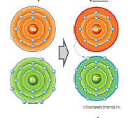
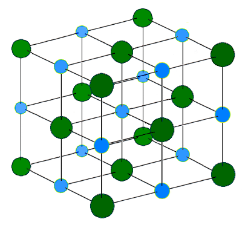
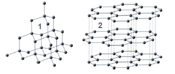
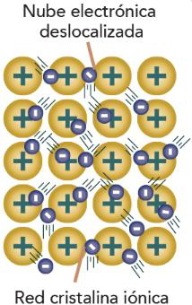
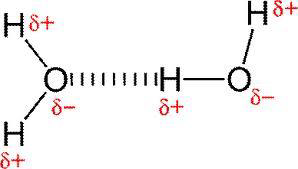

# El enlace químico

Los átomos tienden a unirse entre ellos mediante enlaces químicos. Se forman así los
compuestos químicos. Como ya definimos anteriormente, un compuesto químico es una sustancia formada por la combinación química de dos o más elementos químicos.

Los átomos se unen entre ellos porque al hacerlo pasan a una situación de mayor
estabilidad, de menor energía. Los enlaces químicos son uniones entre átomos (y
entre moléculas) generadas por fuerzas de atracción.

Según la regla del octeto, los átomos tienden a adquirir la configuración electrónica
más estable, que es la de los gases nobles, cuya última capa tiene la configuración ns^2^ np^6^. Aquellos átomos que no tengan esa configuración (esos 8 electrones en su última capa) tenderán a adquirirla uniéndose a otros. Unos lo harán captando los electrones que les falten y otros perdiendo los que les sobren. De esa manera, los átomos establecen enlaces entre ellos.

Existen tres tipos básicos de enlace: iónico, covalente y metálico. A continuación vamos a estudiar cada uno de ellos.

## Enlace iónico

Se establece entre átomos con electronegatividades muy diferentes (por lo general, un metal y un no metal): uno tiene una electronegatividad muy baja y el otro es muy electronegativo. Un átomo tendrá entonces mucha tendencia a perder electrones y el otro a ganarlos → se transfieren electrones de uno al otro → se forman iones + y - → se establece una atracción electrostática (entre cargas opuestas), el enlace iónico. NaCl.

En los compuestos iónicos no se forman moléculas, sino cristales iónicos, agregados de iones que forman redes cristalinas (geométricas) de extensión indefinida. Los óxidos metálicos (combinaciones de metal-no metal) se forman por este tipo de enlace, pues el oxígeno es un no metal que enlaza con un metal (Al2O3, Fe2O3, Na2O).

{ width=25% }

## Enlace covalente

Se establece entre átomos no metálicos, ambos con alta electronegatividad. No hay transferencia de electrones de un átomo al otro, ninguno de los átomos gana electrones del otro, sino que se comparten los electrones del enlace. Cada átomo atrae (por su alta electronegatividad) a un electrón del otro y estos dos electrones constituyen ahora un par compartido por ambos átomos (representado con una línea recta), que se mantendrán unidos por la atracción de los núcleos sobre los dos electrones del par, lo que supone la formación de un enlace.

- Dos átomos de cloro comparten un par de electrones (un electrón de cada uno), generándose así un enlace covalente sencillo. Cl-Cl Cl2
- Dos átomos de oxígeno comparten dos pares de electrones (dos de cada uno), generándose así un enlace doble. O=O O2
- Dos átomos de nitrógeno comparten seis electrones (tres de cada uno), generándose así un enlace triple. N=N N2
- Un átomo de cloro y otro de hidrógeno comparten dos electrones, generando así la molécula de HCl (ácido clorhídrico). H-Cl

Un enlace covalente puede ser apolar o polar, según cómo sean los átomos que se unen.

- *Apolar*: Entre átomos iguales o con una electronegatividad muy parecida (H2 H-H, O2 O=O, Cl2)

- *Polar*: Entre átomos diferentes o con diferente electronegatividad. (HCl, H-Cl) El átomo más electronegativo atrae más a los electrones del enlace, dando lugar a una carga parcial ($\sigma$) negativa en ese átomo y una positiva en el otro. La molécula es entonces polar, un dipolo.

{ width=60% }

Los compuestos covalentes pueden formar **moléculas** (representadas por su fórmula, en la que se indica cuántos átomos hay de cada elemento: Cl2, H2, O2, CO2, Cl2O, HCl, etc.) o **cristales**, en los que los átomos forman, como en las sustancias iónicas, redes cristalinas (es el caso del diamante y el grafito, que forman redes geométricas de átomos de carbono).

## Enlace metálico

Se establece entre átomos metálicos. Los átomos de los metales tienen tendencia a perder electrones (para tener la configuración más estable, ocho electrones en su última capa) convirtiéndose en cationes. Los electrones desprendidos se mueven libremente entre los cationes, sin pertenecer a ninguno: todos los electrones sueltos son compartidos por todos los cationes. Se forma así una estructura de iones positivos (red metálica) entre los que se mueven libremente los electrones (nube electrónica), estableciéndose fuerzas electrostáticas que mantienen fijos a los iones metálicos. La movilidad de los electrones hace que las sustancias metálicas (cobre, plata, oro, hierro, aluminio, etc.) sean muy buenos conductores de la electricidad y el calor.

{ width=25% }

En los metales, como en los compuestos iónicos, no se forman moléculas, sino **redes tridimensionales de iones positivos**.

## Fuerzas intermoleculares

Son atracciones entre moléculas covalentes por fuerzas electrostáticas de menor intensidad que las de un enlace. Son débiles, pero gracias a ellas no todas las sustancias son gases, y condicionan el estado de agregación de muchas sustancias. A grandes rasgos existen dos tipos en función de su intensidad y sus efectos en la materia:

- **Fuerzas de Van der Waals:** son fuerzas muy débiles entre dipolos moleculares. Son responsables de fenómenos como la adhesión, el rozamiento, la difusión, la tensión superficial y la viscosidad y de las uniones enzima-sustrato y antígeno-anticuerpo. Se pueden dar entre diferentes tipos de dipolos, dando lugar fuerzas con distinto grado de intensidad. Se producen en todas las moléculas, sean polares o no.

- **Puente o enlace de hidrógeno:** son fuerzas que se establecen entre un hidrógeno que está unido a un átomo extremadamente electronegativo (solo cumplen esta condición el N, O y F) y otro átomo muy electronegativo capaz de *prestar* al hidrógeno una pareja de electrones sin compartir. Este tipo de enlaces son los responsables de la gran cohesión interna del agua líquida y de muchas otras de sus propiedades. También están presentes en muchas biomoléculas manteniendo su estructura (ADN, proteínas).

{ width=50% }
