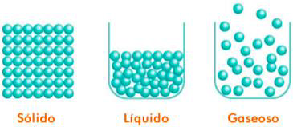

# Teoría cinético molecular (TCM)

## Propiedades de la materia

Una sustancia se identifica y se distingue de otras por sus propiedades, físicas y químicas. Las propiedades de la materia son de dos tipos: generales y específicas.

> **Propiedades generales**
> :     son las características que presentan todos los cuerpos y que no sirven para identificar o distinguir sustancias. Las dos principales son la masa y el volumen, pero también son propiedades generales el peso, la temperatura, la inercia o la divisibilidad.

> **Propiedades específicas**
> :     son las que caracterizan a cada sustancia y permiten su identificación y su diferenciación. No dependen de la cantidad de masa que se considere. Pueden ser físicas o químicas. Son propiedades específicas físicas la densidad, el punto de ebullición, punto de fusión, solubilidad, dureza, elasticidad, viscosidad, transparencia, índice de refracción de luz, ductilidad, maleabilidad. Son propiedades específicas químicas la acidez, la basicidad, la conductividad eléctrica, el poder oxidante, el poder reductor o la reactividad.

## Los cambios de estado

Una de las propiedades más visibles de la materia es que las sustancias pueden existir en estado sólido, líquido o gaseoso. A estos estados se les llama estados de agregación de la materia. Las características definitorias de los tres estados son:

                 **Sólido**       **Líquido**           **Gas**
-------------  --------------   ------------------  ------------------
Forma               Fija         Sin forma propia    Sin forma propia
Volumen             Fijo         Fijo                Variable
Compresible         No           Poco                Sí
Expandible          No           No                  Sí

## Postulados de la TCM

En el siglo XIX y para explicar el comportamiento de los gases, varios científicos elaboraron la teoría cinético-molecular (TCM), que puede resumirse en los siguientes postulados:

1) Los gases están formados por partículas (átomos o moléculas) muy separadas entre sí, por lo que el volumen de estas partículas es muy pequeño comparado con el volumen total del gas.

2) Las partículas están en movimiento continuo y aleatorio, chocando entre ellas y contra las paredes del recipiente que las contiene. Esos choques son los responsables de la **presión** ejercida por el gas.

3) La **temperatura** del gas es la manifestación del movimiento de sus partículas, siendo proporcional a la energía cinética media de las partículas. Cuanto mayor sea la velocidad de las partículas, mayor será su energía cinética y, por tanto, la temperatura del gas (y viceversa).

4) Al estar muy separadas entre ellas, la fuerza de atracción entre las partículas es nula, por lo que no pueden mantenerse unidas.

Aunque la TCM hace referencia a los gases, podemos extender sus explicaciones al resto de estados de la materia, analizando el efecto de la temperatura en la cohesión entre las partículas de una sustancia.

## Los cambios de estado según la TCM

Los cambios de estado pueden explicarse teniendo en cuenta los postulados de la teoría cinético-molecular, ya que el estado de una sustancia depende, como vimos, de la fuerza de unión entre sus partículas y esta puede variar al cambiar el movimiento y, por tanto, la energía cinética, de dichas partículas.

**Descenso de la temperatura:** En una sustancia gaseosa las fuerzas de unión entre las partículas son prácticamente nulas. Si se enfría el gas, la energía cinética de esas partículas (que es proporcional a la temperatura) disminuye, por lo que disminuye su velocidad (se reduce la agitación térmica), lo que hace que puedan aproximarse lo suficiente como para que las fuerzas de atracción entre las partículas puedan aumentar. Si la temperatura baja lo suficiente, las partículas entran en contacto y se unen entre ellas, pero manteniendo una energía cinética suficiente como para no permanecer en posiciones fijas, sino que se desplazan entre ellas: el gas pasa al estado líquido. Si la temperatura baja más, la energía cinética de las partículas disminuye aún más, por lo que las fuerzas de interacción se hacen muy intensas, lo que hace que las partículas queden en posiciones fijas: el líquido pasa al estado
sólido.

**Aumento de la temperatura:** Al aumentar la temperatura, se invierten todos los procesos anteriores, dándose los cambios de estado inversos: \ch{"sólido" -> "líquido" -> "gas"}.

# Los gases

En los gases, las variables de presión, volumen y temperatura están estrechamente ligadas, de forma que el cambio en una de ellas afecta a las demás.

El **volumen** de un gas es el espacio que ocupa. La unidad de volumen en el Sistema Internacional (SI) es el metro cúbico (#m3), pero para fluidos (gases y líquidos) suele usarse el litro (L o l) por tener un tamaño menor y ser más manejable en el día a día. La equivalencia es $1#m3 = 1000#L$.

En un gas, la presión es la fuerza que ejercen sus partículas (por unidad de superficie) al chocar contra las paredes del recipiente que lo contiene.

La **presión** se define como la fuerza ejercida por unidad de superficie. $p = \frac{F}{S}$. La unidad de fuerza en el SI es el newton (N), por lo que la unidad de presión en el SI es la equivalente a 1#N/m2, que se denomina pascal (Pa). El pascal es una unidad muy pequeña para trabajar con gases, por lo que se utilizan con frecuencia otras unidades de presión, como la atmósfera (#atm), el bar (#bar) o el milímetro de mercurio (#mmHg).

<!-- $1#atm = 101325#Pa = 1013#hPa$ o milibares. 
Falta tabla de cambios de unidades de presión -->

## Ley de Boyle-Mariotte

El volumen de un gas es inversamente proporcional a la presión ejercida sobre él: si la presión aumenta al doble, el volumen se reduce a la mitad; si la presión se reduce en un tercio, el volumen aumenta al triple.

#### Ejemplo 1
*Las medidas tomadas para un gas a una temperatura concreta se recogieron en la siguiente tabla. Como se ve, la constante k es 4, por lo que la ley de Boyle para este caso concreto será $p \cdot V = 4$. A otra temperatura, k tendrá otro valor distinto.*

#### Ejemplo 2
*Un gas ocupa 5,3#L a una presión de 1,5#atm. ¿A cuánta presión estará si se disminuye su volumen a 2#L?*

$1,5#atm \cdot 5,3#L = p_2 \cdot 2#L$

$p_2 = 1,5#atm \cdot \frac{5,3#L}{2#L}$

$p_2 = 3,975#atm$

## Leyes de Charles y Gay-Lussac

Charles y Gay-Lussac estudiaron cómo se comportan los gases a diferentes temperaturas, manteniendo la presión o el volumen constante. La temperatura que se considera en todos los casos es la absoluta, medida en Kelvin (K), cuya equivalencia con la escala centígrada es:

$$T (#K) = T (#ºC) + 273$$

> **Ley de Charles**
> :     Si se mantiene la presión constante, el volumen de un gas es directamente proporcional a la temperatura absoluta (al aumentar la temperatura, aumenta la energía cinética de las moléculas, su velocidad, y ocupan mayor volumen).

Al variar la temperatura, el cociente entre el volumen que ocupa y su temperatura absoluta permanece constante:
$$\frac{V}{T} = cte \qquad \frac{V_1}{T_1} = \frac{V_2}{T_2}$$

#### Ejemplo
*Los vapores de una sustancia a 21#ºC de temperatura ocupan 1,5#L. Calcula el volumen que ocupará si la temperatura baja a 12#ºC y la presión se mantiene constante.*

Al mantenerse constante la presión, se aplica la *ley de Charles*.

$21#ºC = 21 + 273#K = 294#K \qquad 12#ºC = 12 + 273#K = 285#K$

$\frac{1,5#L}{294#K} = \frac{V_2}{285#K \cdot V_2} = \frac{1,5}{294 \cdot 285} = 1,45#L$

> **Ley de Gay-Lussac**
> :     Si se mantiene el volumen constante, la presión de un gas es directamente proporcional a la temperatura absoluta (al aumentar la temperatura, aumenta la energía cinética de las moléculas, su velocidad, y aumenta el número de choques por unidad de tiempo, lo que aumenta la presión).

Al variar la temperatura, el cociente entre la presión que ejerce y su temperatura absoluta permanece constante:
$$\frac{p}{T} = cte \qquad \frac{p_1}{T_1} = \frac{p_2}{T_2}$$.

#### Ejemplo
*Los vapores de una sustancia a 21#ºC de temperatura alcanzan, en un recipiente cerrado, una presión de 2400#Pa. Calcula la presión que alcanzaría si la temperatura aumenta a 32#ºC.*

Al ser un recipiente cerrado, el volumen se mantiene constante y se aplica la *ley de Gay-Lussac*.

$21#ºC = 21 + 273#K = 294#K \qquad 32#ºC = 32 + 273#K = 305#K$

$\frac{2400#Pa}{294#K} = \frac{p_2}{305#K \cdot p_2} = \frac{2400}{294 \cdot 305} = 2490#Pa$

## Ecuación general de los gases ideales

En condiciones normales (0#ºC, 1#atm), un mol de un gas ocupa 22,4#L. Cuando estos valores cambian, se utiliza la ecuación general de los gases ideales.

Esta ecuación ecuación describe la relación entre la presión, el volumen, la cantidad (en moles) y la temperatura de un gas ideal (un gas hipotético formado por partículas sin atracción ni repulsión entre ellas y cuyos choques son perfectamente elásticos).
$$pV = nRT$$
Donde $p$ es la presión (#atm), $V$ el volumen (#L), $n$ el número de moles (#mol), $T$ es la temperatura (#K) y $R$ es la constante universal de los gases ideales ($R = 0.082#atm·L/mol/K$). Al usar esta ecuación, todas las unidades deben ser coherentes, es decir, las unidades de la constante $R$ para cada magnitud deben coincidir con las que usamos en la ecuación.

#### Ejemplo
*Calcula el volumen que ocupan 4,3e7#mol de un gas, a una presión de 8e5#atm y a una temperatura de 450#ºC.*

$$T = 450 + 273 = 723#K \qquad V = \frac{nRT}{P} = \frac{4,3e7# \cdot 0,082 \cdot 723}{8e5#} = 3186,6#L$$

