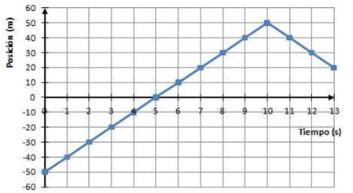
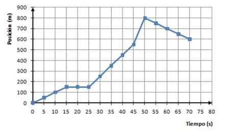
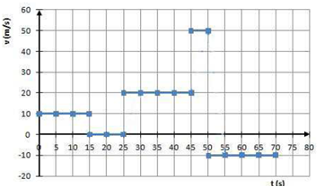
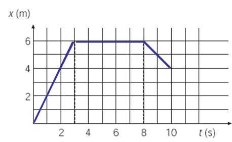
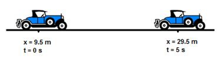
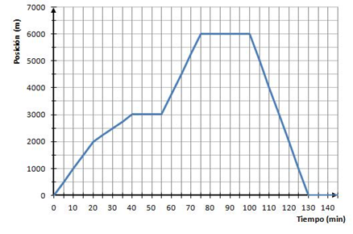
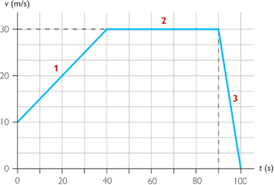

---
encabezado:
  titulo: Ficha de ejercicios
  subtitulo: Unidad 6. Corre, corre que te pillo
  nivel: 3º ESO
xsim:
  exercise:
    print: false
    template: gedmargin
  solution:
    print: true
    template: gedmargin # gedsolution
    name: 'S'
  endsolution: false
---

# Posición y desplazamiento

1.  Una bola va desde A hasta B. 
    
    \begin{center}
    \begin{tikzpicture}[scale=1]
        \draw (-3.5,0) -- (5.5,0);
        \foreach \x in {-3,-2,-1,1,2,3,4,5}
        \draw (\x,0.2) -- (\x,-0.2);
        \draw[red,thick] (0,-0.5) -- (0,2) node[red,isosceles triangle,fill,anchor=north west,text=white,font=\small,scale=0.5] {origen};
        \node[font=\Large] (A) at (-3,-0.5) {A};
        \node[font=\Large] (B) at (5,-0.5) {B};
        \filldraw[fill=cyan,draw=blue] (-3,0.5) circle [radius=0.5];
        \filldraw[fill=cyan,draw=blue] (1,0.5) circle [radius=0.5];
        \filldraw[fill=cyan,draw=blue] (5,0.5) circle [radius=0.5];
        \draw[<->,pink] (-2,0.3) -- node[above=2pt] {3 s} (-1,0.3);
        \draw[<->,green] (-2,-0.3) -- node[below=2pt] {10 m} (-1,-0.3);
    \end{tikzpicture}
    \end{center}

    Teniendo en cuenta la figura, contesta a las siguientes cuestiones:
    a) ¿Cuál es la posición inicial de la bola?
    b) ¿Cuál es la posición final de la bola?
    c) ¿Cuánto tiempo tarda la bola en llegar al origen del sistema de referencia?
    d) ¿Cuanto tiempo tarda en llegar a la posición 10#m?

    {S}
    a)  -30#m
    b)  50#m
    c)  9#s
    d)  12#s

# Velocidad

1. Un atleta alcanza una velocidad de 5#m/s. Calcula su velocidad en #km/h.

    {S} 18#km/h

2. ¿Cuál de los dos siguientes movimientos es más rápido, el del sonido que viaja a 340#m/s o el de un avión comercial que viaja a 1080#km/h?

    {S} El sonido viaja a 340#m/s o 1224#km/h, mientras que el avión viaja a 300#m/s o 1080#km/h. Luego es más rápido el sonido.

3.  Calcula la velocidad media que lleva una moto si a las 11:00 estaba en el kilómetro 45 de la A-66 cerca de Mieres y a las 12:30 estaba en León, en el kilómetro 180 de la misma autovía.

    {S} $v = \frac{180#km-45#km}{1.5#h} = 90#km/h$

4. Calcula la velocidad media en #km/h y #m/s de cada una de las siguientes situaciones:
    a.  Una persona que camina 20 km en 4 horas.
    b.  Una gacela que recorre 10 km en 6 minutos.
    c.  Un atleta que recorre 100 metros en 11 segundos.

    {S}
    a.  5#km/h o 1,39#m/s
    b.  100#km/h o 27,78#m/s
    c.  9#m/s o 32#km/h

5.  Un jugador de fútbol recorre el campo de 120 metros en 30 segundos. Inmediatamente se vuelve y tarda 20 segundo en llegar a la mitad del campo, es decir en recorrer 60 metros. Calcula:
    a.  La velocidad del atleta en cada tramo.                
    b.  La velocidad media del corredor.

    {S}
    a.  $v_1 = 4#m/s$, $v_2 = 3#m/s$
    b.  $v_M = 3,6#m/s$

6.  Un automóvil se desplaza con velocidad media de 90#km/h
    a.  Expresa la velocidad de automóvil en #m/s.
    b.  ¿Cuánto tiempo tardará en cruzar un puente de 270#m de longitud?

    {S}
    a.  25#m/s
    b.  10,8#s

7.  Expresa en el Sistema Internacional las siguientes velocidades: 
    a.	La velocidad de un ciclista que va a 36#km/h
    b.	Un  escarabajo que se mueve a 180#m/h

    {S}
    a. 10#m/s
    b. 0,05#m/s

8.  ¿A qué velocidad se desplaza un automóvil que tarda dos horas en recorrer 240#km? Expresa el resultado en unidades del sistema internacional.
 
    {S} 33,3#m/s

# Aceleración

9.  Un vehículo circula con una velocidad de 72#km/h. El conductor acelera, durante 5 segundos, hasta alcanzar una velocidad de 90#km/h. Calcula la aceleración.

    {S} $a = \frac{25#m/s - 20#m/s}{5#s} = 1#m/s2$

10. Un motorista conduce en línea recta a 72#km/h, acelera de modo que en 1 minuto ha aumentado su velocidad a 126#km/h. 
    a. Expresa el valor de las velocidades en #m/s.
    b. Calcula la aceleración adquirida.

    {S}
    a.  $72#km/h = 20#m/s$; $126#km/h = 35#m/s$
    b.  0.25#m/s2

11. Un guepardo asiático es capaz de pasar de 0 a 100#km/h en 3,5#s, más rápido que muchos coches deportivos. ¿Qué aceleración máxima posee?

    {S} 7.94#m/s2

12. Un avión a reacción posee una aceleración de $6 g$, donde $g$ es la aceleración de la gravedad y su valor es 9,81#m/s2. Calcula el tiempo que tarda en pasar de 300#km/h a velocidad supersónica (340#m/s).

    {S} 4.36#s

13. Un coche tarda 11 segundos en alcanzar los 108#km/h y una moto 7 segundos en alcanzar los 90#km/h, ¿cuál de los dos tiene mayor aceleración?

    {S} Aceleración coche: 2,7#m/s2, aceleración moto: 3,6#m/s2

# Gráficas del movimiento

10. Las siguientes gráficas corresponden todas a movimientos uniformes. Asocia cada gráfica con su ecuación de movimiento correspondiente:

    \begin{tblr}{
        colspec = {XXX},
        cells = {c},
    }
    \begin{tikzpicture}
        \begin{axis}[
            posicion tiempo,
            xmin=0, xmax=11,
            ymin=0, ymax=140,
            ]
            \addplot[
                color=blue,
                style=very thick,
                domain=0:10,
            ]   {15 + 10*x};
        \end{axis}
    \end{tikzpicture}
    &
    \begin{tikzpicture}
        \begin{axis}[
            posicion tiempo,
            xmin=0, xmax=11,
            ymin=-30, ymax=38,
            ytick distance=10,
            ]
            \addplot[
                color=blue,
                style=very thick,
                domain=0:10,
            ]   {-20 + 5*x};
        \end{axis}
    \end{tikzpicture}
    &
    \begin{tikzpicture}
        \begin{axis}[
            posicion tiempo,
            xmin=0, xmax=11,
            ymin=-100, ymax=20,
            ]
            \addplot[
                color=blue,
                style=very thick,
                domain=0:10,
            ]   {15 - 10*x};
        \end{axis}
    \end{tikzpicture}
    \\
    $x = 15-10t$ & $x = 15+10t$ & $x = -20+5t$
    \end{tblr}

    {S} Primera gráfica: $x = 15+10t$; Segunda gráfica: $x = -20+5t$; tercera gráfica: $x = 15-10t$

11. En la  tabla están recogidos las posiciones de un senderista en distintos momentos:
   
    Tiempo (h)       0   1    2    4
    --------------- --- ---- ---- ----
    Posición (km)    5   10   15   25

    a. Elabora la gráfica posición-tiempo. 
    b. Elabora la gráfica velocidad-tiempo.

13. Unos excursionistas parten en bicicleta de su casa.  
    Comienzan pedaleando a 16#km/h durante una hora y media y se detienen media hora a descansar. Reanudan la marcha con una velocidad constante de 10#km/h, tardando dos horas en llegar a su destino. 
    a.  Calcula el espacio recorrido en cada tramo.
    b.  Haz una tabla donde se indiquen los tiempos y las posiciones de los excursionistas.
    c.  Construye una gráfica posición-tiempo para la excursión descrita.
    d.  Determina la velocidad media durante todo el recorrido.
    e.  Si salen de su casa a las 9 de la mañana. ¿A qué hora llegarán a su destino?

    {S} Tramo 1: 16#km/h en 1,5#h: 24#km (1); Tramo 2: 10#km/h en 2 horas: 20#km

    Tiempo (h)       0   1,5   3,5 
    --------------- --- ----- -----
    Posición (km)    0   24    44

    Velocidad media: $v_m = \frac{44km}{3,5#h} = 12.57#km/h$.

    Llegarán a su destino a las 12:30.

14. La gráfica de un movimiento es la siguiente:

    { width=60% }

    Indica si las siguientes afirmaciones son verdaderas o falsas:
    a.  El móvil parte del origen de referencia.
    b.  En los primeros 10 segundos se aleja de la posición inicial
    c.  La velocidad del primer tramo es constante y vale 10#m/s
    d.  Cambia bruscamente de sentido a los 5 segundos.
    e.  El espacio recorrido por el móvil es de 130#m.
    f.  La distancia que separa la posición final de la inicial es 20#m.
    g.  Entre los 10 y 13 segundos se acerca a la posición inicial.

    {S}
    a.  Falso (parte de -50#m)
    b.  Verdadero
    c.  Verdadero
    d.  Falso (cambia a los 10#s)
    e.  Verdadero
    f.  Falso (el desplazamiento son $30#m - (-50#m) = 70#m$)
    g.  Verdadero

15. Un ciclista inicia una carrera entre dos señales de la carretera recta separadas 500#m. El ciclista parte de la primera señal (origen del sistema de referencia), inicia en ese instante el movimiento y cuando han transcurrido 40 segundos llega a la segunda señal. Da la vuelta y al cabo de 20 segundos ha recorrido 200#m.
    a. Haz una tabla con la posición del ciclista en distintos tiempos.
    b. Realiza la gráfica posición-tiempo. 

16. La tabla siguiente representa la posición de un móvil en distintos momentos:

    Tiempo (s)      0    1   2    3    4    5
    --------------- --- --- ---- ---- ---- -----
    Posición (m)    0    5   20   45   80   125

    a.  Representa las posiciones en la trayectoria y razona si el movimiento es uniforme.
    b.  Realiza la gráfica posición-tiempo.
    c.  Calcula la velocidad media en los dos primeros segundos.
    d.  Calcula la velocidad media entre el segundo 3 y el 5.

    {S} Velocidad media en los dos primeros segundos: $v_{0-2} = 10#m/s$

    Velocidad media entre el segundo 3 y el 5: $v_{3-5} = 40#m/s$

17. Dada la siguiente gráfica posición-tiempo, elige la respuesta correcta para las preguntas que se plantean a continuación:

    { width=60% }

    a.  Entre los 0 y los 15 segundos:
        -   El cuerpo se aleja del origen del sistema de referencia con una velocidad de 10#m/s.
        -   El cuerpo sube una pendiente con una velocidad de 10#m/s.

    b.  Entre los 15 y los 25 segundos:
        -   El cuerpo se aleja 150#m del origen del sistema de referencia.
        -   El cuerpo no se mueve, está parado.

    c.  Entre los 25 y 45 segundos:
        -   El cuerpo se aleja del origen del sistema de referencia con la misma velocidad que en el primer tramo del recorrido.
        -   El cuerpo se aleja del origen con mayor velocidad que en el primer tramo.

    d.  El siguiente tramo, entre los 45 y los 50#s, es:
        -   El tramo donde menos metros se mueve.
        -   El más lento.
        -   El más rápido.

    e.  En el último tramo:
        -   El cuerpo ha dado la vuelta y se acerca de nuevo al origen. 
        -   El cuerpo ha terminado de subir la cuesta y está bajándola.

    f. ¿Y cuál ha sido la velocidad del último tramo del movimiento?
        -   11,4#m/s
        -   10#m/s
        -   -10#m/s

    g.  El espacio recorrido en todo el trayecto es:
        -   600#m
        -   1000#m
        -   800#m

    h.  La gráfica velocidad-tiempo:
        { width=40% }
        -   Corresponde a este movimiento excepto en el tramo entre los 50 y los 70 segundos.
        -   Corresponde a este movimiento excepto en el tramo entre 15 y 25  segundos.
        -   Corresponde a este movimiento.

    {S} Las respuestas correctas son las siguientes:
    a.  El cuerpo se aleja del origen del sistema de referencia con una velocidad de 10#m/s
    b.  El cuerpo no se mueve, está parado
    c.  El cuerpo se aleja del origen con mayor velocidad que en el primer tramo.
    d.  El más rápido.
    e.  El cuerpo ha dado la vuelta y se acerca de nuevo al origen.
    f.  −10#m/s.
    g.  1000#m (800#m en un sentido y 200#m en sentido inverso).
    h.  Corresponde a este movimiento.

# MRU

2.  Un balón golpeado por un futbolista lleva una velocidad de 72#km/h. ¿Qué distancia recorrerá en 5 segundos? (Expresa la velocidad en #m/s).

    {S} 100#m

3.  Una pista de tenis tiene una longitud de 24#m. Si un tenista golpea la pelota con una velocidad de 72#km/h. ¿Qué tiempo tardará en atravesar la pista la pelota?

    {S} 1,2 segundos

4.  Un coche se mueve durante 30 minutos a 40#km/h. Después se mueve a 60#km/h durante la siguiente hora. Finalmente durante 15 minutos circula a 20#km/h.
    a.  ¿Qué distancia total habrá recorrido?
    b.  ¿Cuál es la velocidad media de todo el recorrido?

    {S}
    a. 85#km
    b. 48,6#km/h

7.  Un vehículo ha estado controlando un acontecimiento. Se mueve con velocidad constante de 18#km/h
    a.  ¿Cuál es la velocidad del vehículo en el Sistema Internacional?
    b.  ¿Qué distancia ha recorrido el coche en un intervalo de tiempo de 15#min?  (cuidado con las unidades)
    c.  ¿Qué tiempo ha tardado en recorrer una distancia de 2100#m? 

    {S}
    a.  5#m/s
    b.  4,5#km
    c.  7#min

1. Un ciclista sale de su casa, pedalea al mismo ritmo durante 1 hora, recorriendo 30#km. Descansa durante media hora y vuelve a casa con velocidad constante. Tarda 1,5 horas en llegar.
    a. Haz una tabla donde se indiquen los tiempos y las posiciones del corredor.
    b. Con los datos de la tabla haz una gráfica posición-tiempo.

2. Cuando un corredor de atletismo pasa por la marca de los 50 metros ponemos el cronómetro en marcha. Avanza al mismo ritmo durante 10 segundos llegando a la marca de 150 metros, donde se para 10 segundos para hablar con el entrenador. Después continúa corriendo con otra velocidad de manera que en los siguientes 15 segundos se sitúa en la marca de los 250 metros.
    a. Haz una tabla donde se indiquen los tiempos y las posiciones del corredor.
    b. Con los datos de la tabla haz una gráfica posición-tiempo.

1.  Un ciclista, que se mueve con velocidad constante, pasa por delante del punto kilométrico 20 cuando pone el cronómetro en marcha. Avanza al mismo ritmo durante 25 minutos y llega hasta el punto kilométrico 40. Allí se toma un descanso de 20 minutos y luego prosigue su marcha con velocidad constante, recorriendo los siguientes 20#km en 10 minutos.
    a.	Construye una tabla con los datos del enunciado y elabora la gráfica posición-tiempo.
    b.	Calcula la velocidad del ciclista en cada tramo del recorrido.
    c.	Dibuja la gráfica velocidad-tiempo para el movimiento del ciclista.
    d.	Calcula la velocidad media para todo el recorrido.

3.  Un móvil se encuentra en la posición inicial $x_0 = 3#m$ y se mueve en el sentido positivo del eje OX con velocidad constante de 8#m/s.
    a.  Escribe la ecuación de movimiento
    b.  Calcula su posición al cabo de 10#s. 
    c.  La distancia recorrida en ese tiempo. 

1.  La gráfica representa posición-tiempo del recorrido de un coche que sigue una trayectoria recta:
    { width=75% }

    a. Describe el movimiento del coche.
    b. Calcula el espacio recorrido por el coche

2. Un chico juega con un coche teledirigido en una pista. La gráfica representa el movimiento del coche.
    { width=75% }

    a.  Construye una tabla que recoja la posición del coche.
    b.  Explica como ha sido el movimiento del coche.
    c.  Calcula el espacio recorrido por el coche.

4. Un automóvil recorre una recta con velocidad constante. En los instantes $t_1 = 0#s$ y $t_2 = 5#s$, sus posiciones son $x_1 = 9,5#m$ y $x_2 = 29,5#m$.
    

    A partir de estos datos, determina: 
    a.  La velocidad a la que se desplaza. 
    b.  Ecuaciones del movimiento. 
    c.  Las gráficas velocidad-tiempo y posición-tiempo correspondientes a su movimiento 
    d.  El tiempo que tarda en alcanzar la posición $x = 40#m$.

9.  A Teresa le gusta la bici. Cada vez que puede la coge para hacer algunos kilómetros. Esta tarde ha decidido ir a visitar a su amiga Rosa para charlar un rato con ella y luego volverse a casa. Aunque en el camino de ida ha tenido algún contratiempo, el de vuelta lo ha podido hacer del tirón. 
    
    Esta es la gráfica posición-tiempo del recorrido que Teresa ha hecho esta tarde:

    { width=75% }

    Con la ayuda de la gráfica posición-tiempo anterior, responde a estas cuestiones: 
    a.  ¿En qué intervalos de tiempo ha estado Teresa parada (si es que lo ha estado en algún momento)?
    b.  ¿Qué velocidad ha llevado Teresa en el último tramo de su movimiento?
    c.  ¿A qué distancia de la casa de Teresa vive su amiga Rosa? ¿Cuál es la distancia total que ha recorrido Teresa?
    d.  Redacta un texto breve donde cuentes cómo ha sido el viaje de Teresa

11. La ecuación de un movimiento rectilíneo y uniforme es:
    $$x = -17 + 4,5t$$
    Teniendo en cuenta que el sistema de referencia que se ha usado para establecer esa ecuación ha sido:
    { width=50% }
    Señala las respuestas que consideres correctas:
    a.  Al iniciar el movimiento, el cuerpo se encuentra a la izquierda del origen del sistema de referencia.
    b.  El objeto se mueve con una velocidad constante, de 17#m/s. 
    c.  El cuerpo se mueve, hacia la izquierda, con una velocidad constante de 4,5#m/s.

1.  En la recta de una pista de pruebas un coche es capaz de pasar de 0 a 90#km/h en 5#s.
    a.	Transforma los 90#km/h a #m/s.
    b.	¿Cuál es su aceleración?
    c.	Haz una tabla con la velocidad del coche cada segundo.
    e.	Dibuja la gráfica velocidad-tiempo.
    f.	¿El movimiento del coche es rectilíneo y uniforme?

14. Si el tiempo de reacción medio de un adulto es de 0,75 segundos, calcula:
    a. La distancia que recorre un conductor, como mínimo, desde que observa un peligro hasta que toma una decisión, si viaja a 120#km/h. ¿Y si viaja a 50#km/h?
    b. ¿Cuál es la distancia de seguridad del coche que circula a 120#km/h? ¿Y si va a 50#km/h?

    {S}
    a.  25#m y 10,4#m
    b.  50#m y 20,8#m

15. El movimiento, sobre una línea horizontal, correspondiente a un móvil viene dado por la expresión $x = 10 + 20t$, donde el espacio se indica en metros y el tiempo en segundos. Calcula:
    a.  La posición del objeto a los 30#s
    b.  El tiempo transcurrido hasta que el móvil se encuentre a 500#m del origen.
    c.  ¿Cuál es la velocidad del móvil?
    d.  Representa gráficamente el movimiento.

    {S}
    a.  610#m
    b.  24.5#s
    c.  20#m/s

# MRUA

6.  Un vehículo circula con una velocidad de 36#km/h. El conductor acelera, durante 5 segundos, hasta alcanzar una velocidad de 72#km/h. 
    a. Expresa las velocidad inicial y final del vehículo en #m/s.
    b. Calcula la aceleración.
    c. Haz una tabla con la velocidad del coche cada segundo.

    {S}
    a.  10#m/s y 20#m/s
    b.  2#m/s2

1.  La tabla representa las posiciones de un coche de pruebas sobre una pista recta en distintos momentos: 

    Tiempo(s)        0   1   2   3   4    5
    --------------- --- --- --- --- ---- ----
    Posición (m)     0   1   4   9   16   25

    a.  Haz un esquema de las posiciones del coche sobre la pista
    b.  Elabora la gráfica posición-tiempo.
    c.  Razona si la velocidad y la aceleración son positivas o negativas.
    d.  Calcula la velocidad media en los dos primeros segundos del recorrido y entre el segundo 3 y 5.

    {S} La velocidad es positiva, porque el móvil se aleja del origen. Como la velocidad es cada vez mayor, la aceleración también es positiva.

    $v_{0-2} = 2#m/s$, $v_{3-5} = 8#m/s$

3.  Una locomotora se mueve a una velocidad de 90#km/h y frena con una aceleración de 1#m/s2. Calcula:
    a.  La velocidad de la locomotora a los 4 segundos de empezar a frenar.
    b.  El tiempo empleado en dicho proceso de frenado.
    c.  Dibuja una gráfica **v-t**.

    {S}
    a.  21#m/s
    b.  25#s

4.  Se deja caer una piedra desde un acantilado y tarda 4 segundos en llegar al suelo. Al bajar aumenta la velocidad 9,8#m/s cada segundo.
    a.	Anota en una tabla la velocidad de la piedra cada segundo.
    b.	¿Cuál es su aceleración?
    c.	Dibuja la gráfica velocidad-tiempo.

    {S} La aceleración es 9.8#m/s2.

5.  Un motorista, cumpliendo las normas de tráfico, atraviesa una población a una velocidad de 36 km/h (10#m/s). Cuando sale a la carretera, aumenta la velocidad hasta alcanzar 108#km/h (30#m/s). En este aumento de velocidad invierte un tiempo de 40#s. El motorista sigue con velocidad constante de 30#m/s durante 50 segundos. En ese momento divisa una señal de STOP y detiene su vehículo en 10 segundos. La gráfica velocidad-tiempo que representa el movimiento del motorista es la siguiente:

    { width=60% }

    Calcula la aceleración en cada tramo.

    {S} $a_1 = 0,5#m/s2$; $a_2 = 0#m/s2$; $a_3 = -3#m/s2$

# Preguntas de repaso

3.  ¿Cuáles de estos vehículos serán fotografiados por el radar y multados por la policía de trafico cuando circulan por una autopista, donde el límite de velocidad es 120#km/h?
    a.	Un coche que viaja a 1500#m/min
    b.	Un autobús que se mueve a 2#km/min
    c.	Una moto con una velocidad de 40#m/s
    d.	Un camión que circula a 70 millas por hora. (Dato: $1\text{ milla} = 1609#m$)

    {S}
    a.  90#km/h (no lo multan).
    b.  120#km/h (no lo multan, pero va en el límite).
    c.  144#km/h (lo multan por exceso de velocidad).
    d.  112.63#km/h (no lo multan).

1.  Un  coche se desplaza con velocidad media de 72#km/h.
    a.  Expresa la velocidad del coche en #m/s.
    b.  ¿Cuánto tiempo tardará en cruzar un túnel de 35#m de longitud?
    c.  ¿Qué distancia recorrerá en 10 segundos?

2.  Un motorista conduce en línea recta a 36#km/h, acelera de modo que en 0,5 minutos alcanza una velocidad de 72#km/h.
    a.  Expresa el valor de la velocidad en #m/s.
    b.  Calcula la aceleración adquirida.
    c.  ¿Cuánto aumenta la velocidad del coche cada segundo?

3.  Un ciclista parte de su casa y recorre 4#km en 30 minutos, se detiene durante 30 minutos y reanuda la marcha, tarda 1 hora en llegar a su destino después de recorrer 8#km.
    a.  Haz un esquema que recoja los datos del enunciado.
    b.  Construye una gráfica posición-tiempo para la excursión descrita.
    c.  Determina la velocidad media de cada tramo del recorrido en el Sistema Internacional
    d.  Determina la velocidad media durante todo el recorrido.

4.  Cuando un corredor de atletismo pasa por la marca de los 50 metros ponemos el cronómetro en marcha. Avanza al mismo ritmo durante 5 segundos llegando a la marca de 150#m donde se para 15 segundos para hablar con el entrenador. Después continúa corriendo con otra velocidad de manera que en los siguientes 15 segundos se sitúa en la marca de los 300#m.
    a.  Haz una tabla donde se indiquen los tiempos y las posiciones del corredor.
    b.  Con los datos de la tabla haz una gráfica colocando en vertical la distancia y en horizontal el tiempo.
    c.  Calcula la velocidad del corredor en el primer tramo del movimiento.
    d.  Calcula la velocidad media del corredor en todo el recorrido.

1.  El movimiento de un coche teledirigido viene representado por la siguiente gráfica:

    \begin{center}
        \begin{tikzpicture}[scale=0.1]
            \draw[step=5cm,gray,very thin] (0,0) grid (80,62);
            \draw (0,0) -- (80,0);
            \draw (0,0) -- (0,62);
            \foreach \x in {0,20,40,60,80}
                \draw (\x,1) -- (\x,-1) node[anchor=north] {\x};
            \node[font=\large] (X) at (70,-5) {t(s)};
            \foreach \y/\ytext in {20/200,40/400,60/600}
                \draw (1,\y) -- (-1,\y) node[anchor=east] {\ytext};
            \node[font=\large] (Y) at (-8,50) {x(m)};
            \draw[red,very thick] (0,0) -- (40,50) -- (60,0);
        \end{tikzpicture}
    \end{center}

    Contesta las siguientes cuestiones:
    a.  Velocidad en el primer tramo.
    b.  Velocidad en el segundo tramo.
    c.  Espacio recorrido.
    d.  Distancia que hay entre la posición inicial y la final.
    e.  Intervalo de tiempo en el que el móvil se acerca a la posición inicial.
    f.  Redacta un texto explicando el movimiento del coche.
