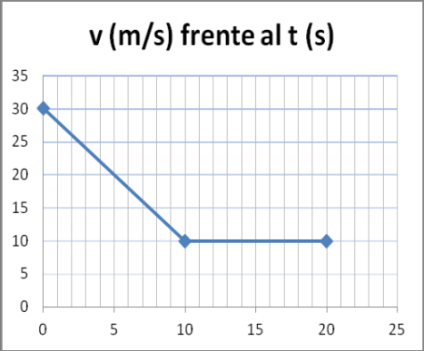
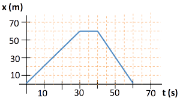

---
encabezado:
  titulo: Actividades de recuperación
  subtitulo: Física y Química - 3ª evaluación
  nivel: 3º ESO
...

Además de repasar todos los conceptos teóricos trabajados la evaluación que están recogidos tanto en las presentaciones en TEAMS como en tu cuaderno, tendrás que realizar las siguientes actividades.

# Unidad 5: ¡Reacciona! (Reacciones químicas)

## Trabajo teórico

-   Define reacción química.
-   Explica la teoría de las colisiones.
-   Explica los factores que afectan a la velocidad de reacción.
-   Enuncia la ley de conservación de la masa.
-   ¿Qué es una ecuación química?

## Actividades

6.  12#g de carbono reaccionan con 32#g de oxígeno (O2) y como
    resultado de la reacción se obtiene dióxido de carbono.
    a)  Escribe y ajusta la reacción.
    b)  ¿Qué masa de dióxido de carbono se ha obtenido? Nombra y enuncia la
        ley que has aplicado para resolver el problema.

7.  El agua oxigenada, H2O2, se descompone en H2O y O2 en una reacción muy lenta.
    a)  Ajusta la reacción: \ch{H2O2 (l) -> H2O (l) + O2 (g)}
    b)  A partir de 340#g de agua oxigenada obtenemos solo 180#g de agua. ¿Por qué?

8.  Para la combustión de 1#g de hidrógeno se necesitan 8#g de oxígeno.
    Calcula qué masa de oxígeno se necesitará para la combustión de 25#g de
    hidrógeno y la masa de agua obtenida.

9.  Al descomponerse 150#g de carbonato de calcio se obtienen 84#g de
    óxido de calcio y se forma cierta cantidad de dióxido de carbono.
    a)  ¿Qué masa de dióxido de carbono se desprende?
    b)  Si se descomponen 75#g de carbonato de calcio ¿qué masa de óxido de
        calcio se obtendría?
    c)  Escribe y ajusta la reacción.

10. Cuando calentamos 50#g de carbonato de calcio, se forman 28#g de
    óxido de calcio y cierta cantidad de dióxido de carbono.
    a)  ¿Qué masa de este gas se habrá formado?
    b)  ¿Qué cantidad de óxido de calcio se forma a partir de 150#g de
        carbonato de calcio?
    c)  ¿Cuál es la proporción en masa con que reaccionan el carbonato de
        calcio y el óxido de calcio?
    d)  ¿Podríamos obtener 56#g de óxido de calcio a partir de 60#g de
        carbonato de calcio?

# Unidad 6: Corre, corre que te pillo (El movimiento)

## Trabajo teórico

-   Concepto de: Movimiento, posición, trayectoria, desplazamiento, espacio recorrido.
-   Concepto de velocidad. Ecuación, unidades en el SI. Diferenciar
    entre velocidad media e instantánea.
-   Concepto de aceleración. Ecuación y unidades en el SI
-   MRU: Gráficas de x-t y v-t. Deducción de la ecuación de posición.
-   MRUA: Gráficas de a-t y v-t.

## Actividades

6.  De la gráfica siguiente:
    { width=40% }

    a)  Indica el tipo de movimiento en cada tramo.
    b)  Calcula la aceleración en cada tramo.

7.  La gráfica que se muestra a continuación representa la posición (m)
    frente al tiempo (s) de un coche en un determinado recorrido.

    { width=60% }

    a)  Completa la tabla posición-tiempo para los puntos A, B, C y D.

                        A              B              C                D
        --------- -------------- -------------- ---------------- --------------
          x (m)                                                     
          t (s)                                                    
        --------- -------------- -------------- ---------------- --------------

    b)  Calcula la velocidad del coche en los tramos A-B, B-C y C-D.

8.  Justifica si las siguientes afirmaciones son verdaderas o falsas:
    a)  Desplazamiento es la línea de unión de los puntos por los
        que pasa un móvil.
    b)  Espacio recorrido es la distancia más corta entre la posición
        inicial y la final.
    c)  Trayectoria es la distancia que recorre el móvil a lo
        largo de la trayectoria.
    d)  El desplazamiento nunca puede ser cero.
    e)  Desplazamiento y espacio recorrido coinciden cuando
        la trayectoria es una línea curva.

9.  El caracol de jardín se desplaza a una velocidad media de 14#mm/s
    mientras que la tortuga gigante avanza a 270#m/h.
    a)  ¿Cuál de los dos se mueve más rápido?
    b)  ¿Cuánto tiempo tardará cada uno de ellos en recorrer una distancia
        de 2#m?

10. Calcula la aceleración que tiene un coche cuando pasa de 33#m/s a
    22#m/s en 20 segundos. Explica el resultado

11. Un galgo puede correr a una velocidad de 90#km/h y un gorrión
    vuela a 27#m/s. Si hiciesen una carrera de 600#m, ¿quién ganaría?

12. María y tú salís vais a echar una carrera. Le das a María 20#m de
    ventaja. Las dos vais en la misma dirección y sentido. La velocidad de
    María es 7#km/h y la tuya es 10#km/h. Calcula:
    a)  ¿Cuánto tiempo tardarás en alcanzar a María?
    b)  ¿Cuántos metros habréis recorrido en ese momento?
    c)  Dibuja las gráficas x-t de ambos en el mismo eje de coordenadas.

13. Un móvil describe un movimiento rectilíneo uniforme cuya ecuación,
    en unidades del SI es: $x = 20 + 5 \cdot t$. Calcula:
    a)  Su posición inicial y su velocidad en #m/s y en #km/h.
    b)  Su posición cuando han transcurrido 6 minutos.
    c)  El desplazamiento que ha realizado entre los 10 y los 40 segundos.
    d)  El tiempo que tarda en alcanzar la distancia de 50#m al punto de
        referencia.
